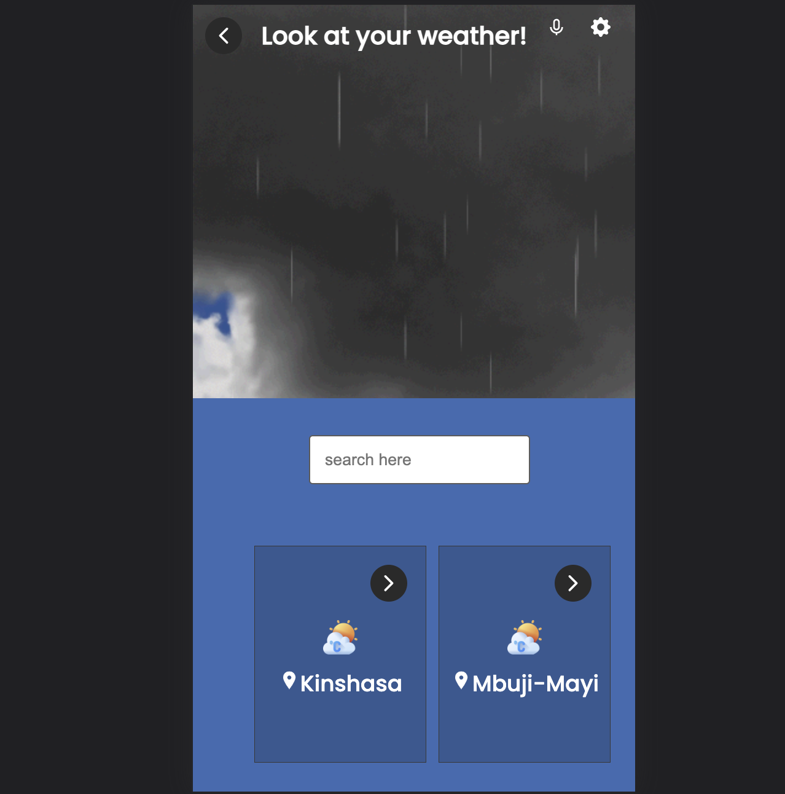
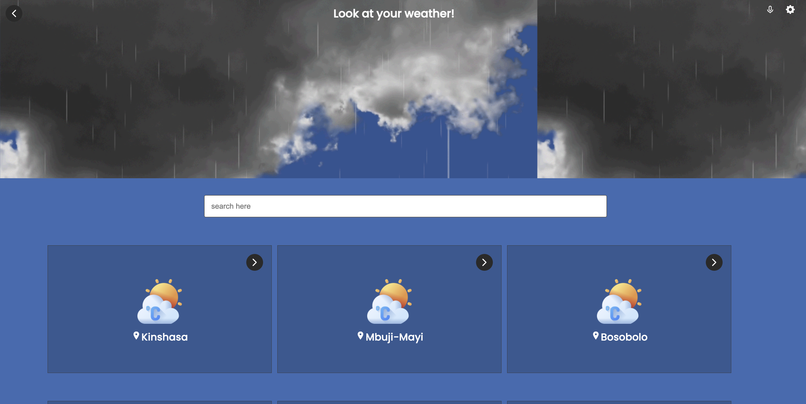

# Weather App

This is a weather application done in both mobile and web version, with emphasize on mobile version. With this app, you can:
- View the weather of any city displayed using weather app API provided by Microverse, and in our case we focus on getting weather from Republic Democratic of Congo.
- Navigate from home page to detail page by a simple clickig on a given item.

## Screenshots: 

#

## Built With

- Major languages: JAVASCRIPT | CSS 
- Major Library: ReactJS/Redux/Sass
- Technologies used : Git | Github | Linter | Jest

## Live video

[live presentation](https://www.loom.com/share/3f67f0b928794ae7b78e3eb1717221e4)

[Code Highlight](https://www.loom.com/share/d0eca547ef994e18bbe2fc935cce5eba)

## Live Demo

[netlify deployment]()

# Getting Started with Create React App

This project was bootstrapped with [Create React App](https://github.com/facebook/create-react-app).
To have the local version of this project in your local PC, first clone the project with: `git clone` https://github.com/Paskab012/react-redux-api.git,
then run the command `npm install` to update all packages locally.
Build the project by running `npm build`
for production.
## Available Scripts

In the project directory, you can run:

### `npm start`
#
### `npm test`

Launches the test runner in the interactive watch mode.\
See the section about [running tests](https://facebook.github.io/create-react-app/docs/running-tests) for more information.

## Author
👤 **PASCAL KABIKA MP.**

- GitHub: [paskab012](https://github.com/KABIKA681?tab=overview&from=2021-12-01&to=2021-12-31)
- [LinkedIn](https://www.linkedin.com/in/pascal-kabika-443061220/)
## 🤝 Contributors

Contributions, issues, and feature requests are welcome!

Feel free to check the [issues page](https://github.com/Paskab012/react-redux-api/issues).

## Acknowlegment

#### The original design idea is based on a template by [Nelson Sakwa](https://www.behance.net/sakwadesignstudio) on Behance, and it licenced by [Creative Commons](https://creativecommons.org/licenses/by-nc/4.0/). I thank him for this tremandous work.

## Show your support

Give a ⭐️ if you like this project!
